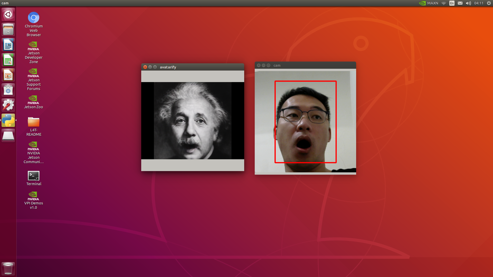

# Run Avatarify in Docker Container on NVIDIA Jetson

Motivated by [alievk/avatarify](https://github.com/alievk/avatarify).

The objetive of this project is to build a Docker image, enables Avatarify to be run in a container using the NVIDIA Container Runtime on Jetson.

The image would built on **nvcr.io/nvidia/l4t-ml:r32.5.0-py3**. It contains lots of pre-built Python packages. That will save compilation time.

## Tested Hardwares

- [x] NVIDIA Jetson Nano 4GB Developer Kit with JetPack 4.5.1

## Prepare Repo on Host

### Pull repositories

```bash
mkdir ${HOME}/work && cd ${HOME}/work
git clone https://github.com/huang06/avatarify.git
cd avatarify
git checkout origin/jetpack-r32.5.0
```

### Download network weights

```bash
# vox-adv-cpk.pth.tar
wget "https://www.dropbox.com/s/t7h24l6wx9vreto/vox-adv-cpk.pth.tar?dl=1" -O vox-adv-cpk.pth.tar
```

### Setup v4l2loopback

```bash
rm -rf v4l2loopback 2> /dev/null
git clone https://github.com/umlaeute/v4l2loopback.git
cd v4l2loopback
make && sudo make install
sudo depmod -a
cd ..
```

### Setup fomm

```bash
rm -rf fomm 2> /dev/null
git clone https://github.com/alievk/first-order-model.git fomm
cd ..
```

### Setup face-alignment

```bash
git clone https://github.com/1adrianb/face-alignment.git
git checkout v1.3.2
# edit setup.py: remove opencv-python at Line 43
cd ..
```

#### Download face_alignment files

```bash
mkdir -p .face_alignment && cd .face_alignment
# 2DFAN4-cd938726ad.zip
wget "https://www.adrianbulat.com/downloads/python-fan/2DFAN4-cd938726ad.zip"
# s3fd-619a316812.pth
wget "https://www.adrianbulat.com/downloads/python-fan/s3fd-619a316812.pth"
cd ..
```

## Build Docker Image

### Start the Docker container

```bash
IMAGE=nvcr.io/nvidia/l4t-ml:r32.5.0-py3
docker pull ${IMAGE}
```

```bash
DISPLAY=":0"
xhost +
docker run --name avatarify -it --rm \
--runtime nvidia --network host \
--privileged \
--cap-add=ALL \
-e DISPLAY=${DISPLAY} \
-v /tmp/.X11-unix/:/tmp/.X11-unix \
-v ${HOME}/.Xauthority:/root/.Xauthority \
-v /lib/modules:/lib/modules \
-v /dev:/dev \
-v ${HOME}/work/avatarify:/avatarify \
-v ${HOME}/work/avatarify/.face_alignment:/root/.cache/torch/hub/checkpoints/ \
--workdir /avatarify \
${IMAGE} \
bash
```

The file path of face_alignment (`${HOME}/torch/hub/checkpoints/`) depends on the version of face_alignment.

### Check the pre-built packages

```bash
$ python3 -V
Python 3.6.9
```

```bash
$ dpkg -l | grep opencv
ii  libopencv                            4.1.1-2-gd5a58aa75                  arm64        Open Computer Vision Library
ii  libopencv-dev                        4.1.1-2-gd5a58aa75                  arm64        Development files for Open Source Computer Vision Library
ii  libopencv-python                     4.1.1-2-gd5a58aa75                  arm64        Python bindings for Open Source Computer Vision Library
```

```bash
$ python3 -m pip list | egrep 'numpy|pandas|torch|scikit'
numpy                1.19.4
pandas               1.1.5
scikit-learn         0.24.0
torch                1.7.0
torchaudio           0.7.0a0+ac17b64
torchvision          0.8.0a0+45f960c
```

### Install Python packages

```bash
apt-get update
apt-get install python3-tk
python3 -m pip --upgrade pip
python3 -m pip install -r requirements.txt
```

### Edit **skimage** script

Ignore the **_validate_lengths** error message.

```bash
cp /usr/local/lib/python3.6/dist-packages/skimage/util/arraycrop.py /usr/local/lib/python3.6/dist-packages/skimage/util/arraycrop.py.bak

sed -i 's/from numpy.lib.arraypad import _validate_lengths/# from numpy.lib.arraypad import _validate_lengths/g' /usr/local/lib/python3.6/dist-packages/skimage/util/arraycrop.py
```

### Install face-alignment

```bash
cd face-alignment
python3 setup.py install
cd ..
```

### Test

Make sure all the required packages were installed.

```bash
./run --no-conda
```

### Commit the Container

```bash
docker commit avatarify avatarify:r32.5.0
```

## Run the application

```bash
bash ./run_docker.sh
```



## TODO

1. Convert the PyTorch model to ONNX, TensorRT formats.
2. Replace the base image with a lightweight one.
3. Create a Dockerfile.

